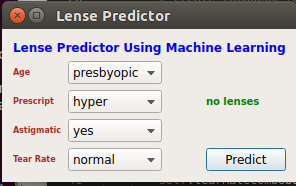

# Decision Tree: Surpervised Classification with Python

## 1. Synopsis
In section one, we implemented and testing our model through the following process:

- Data aquisition
- data analysis
- data preparation
- model building
- Evaluation
- Deployment

In this section two, we will do the following:

- GUI intergration
- Evaluation
- Deployment

In each of these steps, we will write python code to complete them

## 2. File Struction
- **model.py**: This file contain our code for predicton and data storage
- **Images/**: This folder contain images
- **lense_predictor.pyw**: This file contain codes for GUI
- **lense_classifier_checkpoint.txt**: This file contain our classifier object
- **README.md**: You are currently reading this file.

## 2. Summary
### 2.1 GUI intergration
In this section, we will build a GUI and integrate our decision tree algorithm built in section 1 above. The aim of this section is to provide a user friendly interface to the less technical enabling them to predict with ease.

Since we built our algorithm from scratch in section 1. In this section, we will also build our GUI from scratch using PyQt5. However, it is important to note that we could create our user interfaces using Qt's visual design tool, Qt Designer.

### 2.2: Putting things together
For this section, we will need only one file, `lense_predictor.pyw`. This file has codes for building GUI and also has some few functions from section one like 
- classify function 
- grabTree from saveDT.py

The GUI looks like this:

