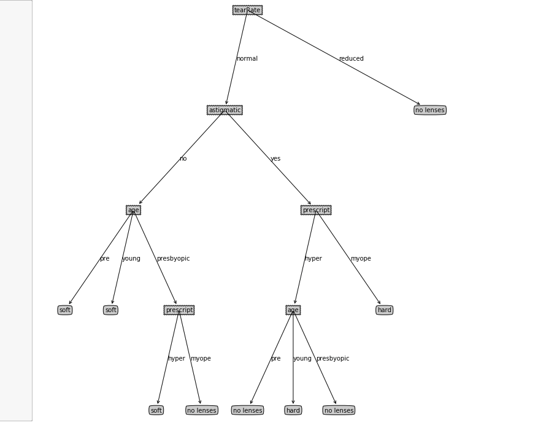

# Decision Tree: Surpervised Classification with Python

## 1. Synopsis
In this project, we will be using the machine learning model **Decision Tree** to predict contact lens type. The project has 2 section. In the first section, we will be investigating and building our model from scratch in a notebook. In the second section, we will build a GUI which a non-technical person can use to predict the contact lens type.

## 2. Motivation
In Supervised Learning, Decision Trees are one of the most popular and most used machine learning algorithms. Some libraries like scikit-learn implements this algorithm which facilitates their usage. However, in this project, I will build this algorithm from scratch with Python to solve the problem "Predicting Contact Lens Type". Also, I will integrate this algorithm into a GUI which could be used by non-technical individuals to predict contact lens type

## 3. Projects Plan
The project will be divided in to 2 sections. The first section will deal with

- Data aquisition
- data analysis
- data preparation
- model building
- Evaluation
- Deployment

The second section will deal with

- GUI intergration
- Evaluation
- Deployment

In each of these steps, we will write python code to complete them

## 4. Project success criteria
The following criteria will determine whether this project has been successful

Build decision trees algorithm from scratch in Python
Predict contact lens type using the decision treee built from scratch
Intergrate the decision tree algorithm into a GUI
GUI is easy to use and attractive in the eyes.

## 5. Poject Requirements
To complete this project, you will need a computer. The required packages and libraries can be found in the requirement.txt fiel. You could install all dependencies from the file with pip as: 

`pip install -r requirements.txt`

## 6. Files structure
brief files structure

## SECTION ONE: Implementing and testing
## 7. Summary
### 7.1 Preparing data
Our dataset are originally represented as numeric in the lenses.data.txt file as:

```  
1  1  1  1  1  3
2  1  1  1  2  2
3  1  1  2  1  3
4  1  1  2  2  1
5  1  2  1  1  3
6  1  2  1  2  2
7  1  2  2  1  3
8  1  2  2  2  1
9  2  1  1  1  3
10 2  1  1  2  2
11 2  1  2  1  3
12 2  1  2  2  1
13 2  2  1  1  3
14 2  2  1  2  2
15 2  2  2  1  3
16 2  2  2  2  3
17 3  1  1  1  3
18 3  1  1  2  3
19 3  1  2  1  3
20 3  1  2  2  1
21 3  2  1  1  3
22 3  2  1  2  2
23 3  2  2  1  3
24 3  2  2  2  3  
```

And since one of the **Pros** of decision tree is that it's easy for humans to understand learned results, we will preprocess our dataset to represent it in a more human-understandable way. Using the lenses.names.txt, we preprocessed as:

```
young    myope    no    reduced    no lenses
young    myope    no    normal    soft
young    myope    yes    reduced    no lenses
young    myope    yes    normal    hard
young    hyper    no    reduced    no lenses
young    hyper    no    normal    soft
young    hyper    yes    reduced    no lenses
young    hyper    yes    normal    hard
pre    myope    no    reduced    no lenses
pre    myope    no    normal    soft
pre    myope    yes    reduced    no lenses
pre    myope    yes    normal    hard
pre    hyper    no    reduced    no lenses
pre    hyper    no    normal    soft
pre    hyper    yes    reduced    no lenses
pre    hyper    yes    normal    no lenses
presbyopic    myope    no    reduced    no lenses
presbyopic    myope    no    normal    no lenses
presbyopic    myope    yes    reduced    no lenses
presbyopic    myope    yes    normal    hard
presbyopic    hyper    no    reduced    no lenses
presbyopic    hyper    no    normal    soft
presbyopic    hyper    yes    reduced    no lenses
presbyopic    hyper    yes    normal    no lenses
```

### 7.2 Modelling
The modeling technique used here is **Decision Tree**. Some libraries like scikit-learn implements this algorithm which facilitates their usage. However, in this project, I will build this algorithm from scratch with Python. 

The final implementation gave the following decision tree graph:


**Figure 1**: Decision Tree for Predicting Contact Lens type

We were able to build our decision tree algorithm from scratch with python, and using a dataset from UCI Machine Learning Repository, we were able to test our algorithm and it predicted well.

Some libraries like scikit-learn are advance machine learning libraries which implements various machine learning algorithm including decision tree. It might have been easily and less tedious to implement it using this library. However, building it from scratch was neccessary as it enabled us to look in to hidden details so as to better understand how decision tree works.
